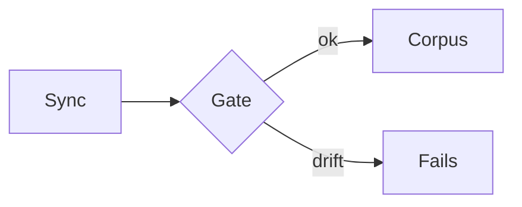
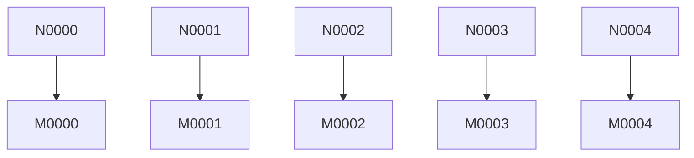

<!-- GENERATED by sync_docs (fixture banner) — cut by the renderer before the pipeline -->

# Golden corpus

Representative corpus for the F0 golden-render gates (ME-011, ADR 0020 Ф0):
every element class both pipelines must agree on, exercised through BOTH
wrappers. F1 extraction is accepted ONLY on a zero behavioral diff against
these snapshots.

## Headings

### Level three

## Body elements

Plain paragraph with **strong**, *emphasis*, `inline code` and a
[good link](https://example.com/ok).

- bullet one
- bullet two
  - nested item

1. first step
2. second step

> A quoted line.

| col a | col b |
| ----- | ----: |
| 1 | two |

---

```bash
helm upgrade vesmaro
```

Inline task list:

- [x] done item
- [ ] open item

## Diagram fence



## Raw HTML section (curated profile only)

<details open><summary>parity details</summary><p>parity body</p></details>

<kbd>Ctrl</kbd> <sub>low</sub> <sup>high</sup>

<p class="language-style-inject">styled div</p>
<span class="language-evil-inject">class injection outside code</span>
<pre><code class="language-python evil-token">print("lang token survives")</code></pre>

## Hostile vectors (both profiles must neutralize)

<script>alert("xss")</script>


<iframe src="https://evil.example/"></iframe>

[bad link](javascript:alert('link'))

[data link](data:text/html;base64,PHNjcmlwdD5hbGVydCgxKTwvc2NyaXB0Pg==)

<style>.hostile-injected-style { color: red }</style>

<svg><use href="https://evil.example/sprite#x"></use><circle r="4"></circle></svg>

<form action="https://evil.example/collect"><input type="text" name="q"><textarea>ta</textarea></form>

<object data="https://evil.example/o"></object>

<embed src="https://evil.example/e">

<details ontoggle="alert('details')" open><summary>details survive, handlers do not</summary>parity body</details>

Giant fence probe (oversized source must fall back, never crash):

